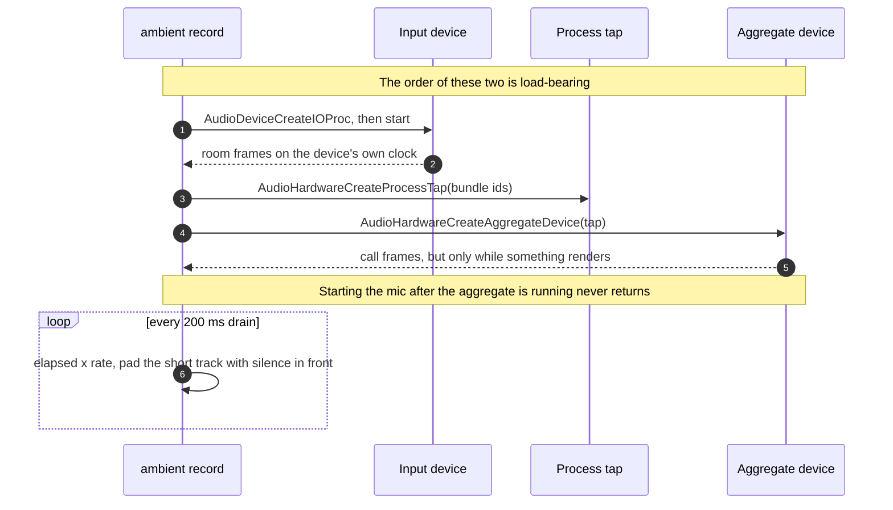

# Capture

How `ambient` gets system audio off a Mac, and the two independent ways that
capture fails silently.

`ambient tap <out.wav> <secs> [bundle-id...]` records system audio through a
Core Audio process tap — no virtual device, no bot in the meeting, and only the
System Audio Recording permission rather than ScreenCaptureKit's Screen
Recording.

**It must be launched as a bundled app through LaunchServices.** Run the bare
binary from a terminal and the tap is created successfully, delivers buffers at
the correct rate, and every sample is zero. TCC attributes the request to the
*responsible process* — the terminal — which has no audio permission and does
not prompt, so the failure is silent in the most literal sense.

```sh
./setup-signing.sh                                   # once — stable identity
./make-app.sh                                        # bundle + sign
open -a "$PWD/build/Ambient.app" --args tap /tmp/out.wav 14
```

The capture path itself looks like this — two separate IOProcs whose start order
is load-bearing; see [two tracks, two clocks](two-tracks.md) for why there are
two:



## The signing identity is load-bearing too

`codesign --sign -` (ad-hoc) makes the app's designated requirement its **own
cdhash**, which changes with every rebuild. TCC stores that hash in the grant's
`csreq`, so a rebuild orphans the permission while leaving the row in place
still reading *allowed*:

```
stored   FADE0C00 00000028 00000001 00000008 00000014 103644AA…8E014B
                                             ↑ opcode 8 = cdhash
current  CDHash = 81c297a4f118a4f1efdb84b2511fddd7c927eb2a
```

The two services then diverge, which is what makes this so confusing:

| Service | csreq matches | Behaviour |
|---|---|---|
| `kTCCServiceMicrophone` | no | keeps working |
| `kTCCServiceAudioCapture` | no | **runs, returns zeros, no error, no prompt** |

These are two independent failures and it is easy to conflate them:

| Launch | Signing | Result |
|---|---|---|
| shell (`build/…/MacOS/ambient`) | anything | **silent** — TCC blames the terminal |
| `open -a` | stale cdhash | **hangs forever** on a prompt nobody sees |
| `open -a` | stable identity | works |

The first row holds regardless of how the app is signed, so fixing the
certificate does not make a terminal launch work — measured after the fix:
direct launch still gave `call peak 0.000`, `open -a` gave `0.869`.

`./setup-signing.sh` fixes this permanently by signing with a certificate, so
the requirement becomes `identifier "uk.ambient.cli" and certificate leaf = …`
and survives rebuilds. `ambient tap` and `ambient record` now detect the silent
case at runtime — they sample `kAudioProcessPropertyIsRunningOutput` during
capture and, if the call track is flat while something was demonstrably playing,
name the likely cause — checking the launch method first (parent pid 1 means
LaunchServices, anything else means a shell), and only then the cdhash.

On a managed Mac a PPPC profile denying `kTCCServiceAudioCapture` produces
**identical** symptoms, so rule the cdhash out before blaming IT.

See [ADR-0001](../adr/0001-core-audio-process-tap.md) and [ADR-0002](../adr/0002-signed-bundle-launch.md).
