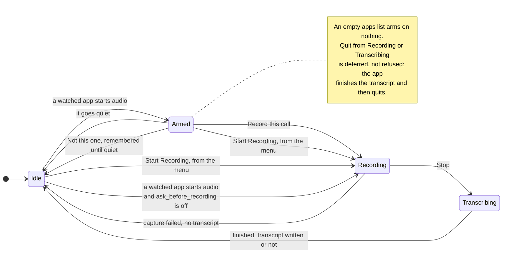

# Consent, retention and names

Consent, retention and the roster are three answers to one question: what this
tool is allowed to keep, and for how long. Consent decides whether a recording
starts at all, retention decides how long the audio outlives the transcript,
and the roster decides what is stored about the people in it.

The menu bar is the consent surface, and it is a state machine:

## Consent: the armed state

With `apps` set, the menu bar watches for one of them producing audio and moves
to a fourth state, **Armed** — the menu then offers *Record this call* or *Not
this one*. Declining is remembered against that bundle and forgotten once it
goes quiet, so saying no to one call does not opt out of the next.

An empty `apps` list watches nothing. That list already means "capture all
system audio", and arming on any sound at all would flap at every notification
chime; the Start item stays the way in.

The check runs on the existing refresh timer, every eighth tick — roughly every
four seconds. Enumerating audio processes twice a second would be waste for
something that changes when a human joins a call.

There is deliberately **no notification**. The bundle carries no entitlements,
and the menu bar is already the consent surface: an unmistakable state you can
see without clicking. A real `UNUserNotificationCenter` prompt is additive and
should be scoped on its own rather than smuggled in here.

## Retention

Audio is the most sensitive artefact here and the least useful once the
transcript exists, so it ages out on a schedule while the text does not.
`audio_retention_days` defaults to 7; `0` deletes the wavs as soon as the
transcript is written, `forever` keeps them. The sweep runs at the end of every
recording — the app is running whenever a recording happens, so no launchd
agent is needed — and it never touches `raw.jsonl`, `edits.jsonl`,
`session.json` or `transcript.md`.

Two guards matter. A session with no `transcript.md` is never swept: it is
still being written, and its audio is the only copy of what was said. That guard
has a consequence worth stating plainly — a recording that *failed* also has no
`transcript.md`, so its audio is kept indefinitely rather than ageing out. Those
directories are the ones to check by hand if you care about the retention
window holding. And
`ambient diarize` **refuses** on a session whose audio has been swept, because
a re-run reverts the previous labels before it discovers there is nothing to
read — which would silently unlabel every speaker nobody had named by hand.

## Who's who

`ambient roster add <name>` keeps a list of the people you record with, in
`roster.json` beside the config. After a recording, the settings window lists
each speaker diarization could not name alongside the first thing that voice
said, and a dropdown of roster names puts a name on every line of that speaker.

It stores **no voiceprints**, so it never guesses. An embedding kept to
recognise someone later is biometric data under Article 9, a different
compliance regime from a text file of names — and a confidently misattributed
turn is a lie in your notes, which is worse than an honest `call-2`. The roster
removes the retyping, not the choosing.

Naming goes through the same `session::name_speaker` the CLI uses, so the edit
is recorded as the user's and survives a re-diarize.

See [ADR-0009](../adr/0009-armed-consent-state.md), [ADR-0010](../adr/0010-names-not-voiceprints.md) and [ADR-0011](../adr/0011-audio-retention-sweep.md).
