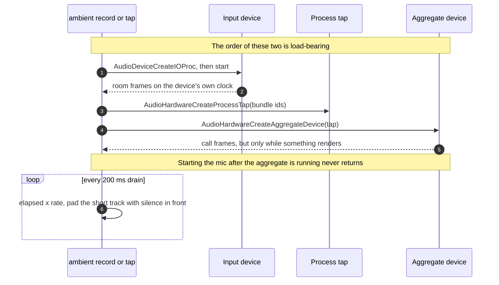

# Capture

How `ambient` gets system audio off a Mac, and the two independent ways that
capture fails silently.

`ambient tap <out.wav> <secs> [bundle-id...]` records system audio through a
Core Audio process tap — no virtual device, no bot in the meeting, and only the
System Audio Recording permission rather than ScreenCaptureKit's Screen
Recording.

**It must be launched as a bundled app through LaunchServices.** Run the bare
binary from a terminal and the tap is created successfully, delivers buffers at
the correct rate, and every sample is zero. TCC attributes the request to the
*responsible process* — the terminal — which has no audio permission and does
not prompt, so the failure is silent in the most literal sense.

```sh
./setup-signing.sh                                   # once — stable identity
./make-app.sh                                        # bundle + sign
open -a "$PWD/build/Ambient.app" --args tap /tmp/out.wav 14
```

By default `record` and `tap` reach the same path, so the participant below
stands for both; `tap --no-mic` (`src/main.rs:235`) starts the tap alone and
skips the input device entirely. The path is two separate IOProcs whose start
order is load-bearing; see [two tracks, two clocks](two-tracks.md) for why
there are two:



## The signing identity is load-bearing too

`codesign --sign -` (ad-hoc) makes the app's designated requirement its **own
cdhash**, which changes with every rebuild. TCC stores that hash in the grant's
`csreq`, so a rebuild orphans the permission while leaving the row in place
still reading *allowed*:

```
stored   FADE0C00 00000028 00000001 00000008 00000014 103644AA…8E014B
                                             ↑ opcode 8 = cdhash
current  CDHash = 81c297a4f118a4f1efdb84b2511fddd7c927eb2a
```


What that divergence looks like in practice, and how to get out of it, is
[When it does not work](../using/troubleshooting.md) — it is a first-run problem
rather than a design one.

See [ADR-0001](../adr/0001-core-audio-process-tap.md) and [ADR-0002](../adr/0002-signed-bundle-launch.md).
