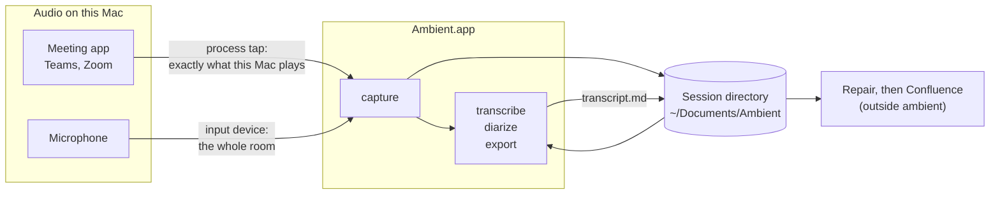
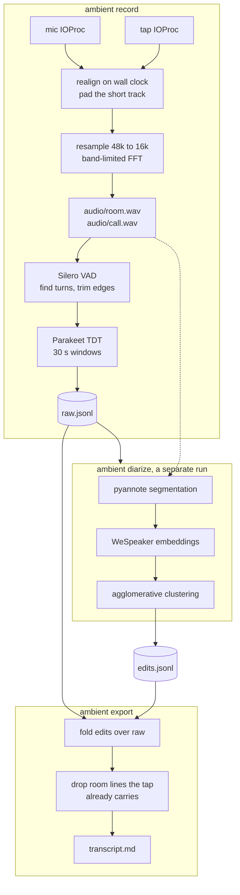

# How it fits together

Ambient is one signed macOS app bundle. It records two audio tracks, transcribes
them on this machine, works out who spoke, and writes a markdown file. Nothing
leaves the Mac until you hand the markdown to something else.

Everything below is a link into the chapter that explains it, and most of those
chapters exist because the obvious approach did not work. The decisions are
recorded separately under [Decisions](../adr/README.md).

## What talks to what

The two arrows into `capture` are the whole design in miniature. The tap hears
only what this Mac renders, so it is the clean copy of the far side and it
cannot pick up the desk next to you. The microphone hears everything in the
room, which is what makes it useful and what makes it the sensitive one. They
are kept apart all the way to the transcript, and merged only at export — see
[capture](capture.md) and [two tracks, two clocks](two-tracks.md).

## What happens to the audio

Diarization is a separate run rather than a stage of `record`, and the dotted
arrow is why it can fail: it needs the wav files, which the
[retention sweep](../using/what-is-kept.md) may have deleted. It refuses rather
than reverting labels it then cannot replace.

`record` writes `raw.jsonl` and never touches it again. Everything after that —
diarization's labels, a name you type, a revert — is a line appended to
`edits.jsonl`, and `transcript.md` is recomputed from the two. See
[sessions and the edit layer](sessions.md).

## Where the hard parts are

| Chapter | The thing that was not obvious |
| --- | --- |
| [Capture](capture.md) | A terminal-launched binary gets a working tap that returns silence, with no error and no prompt |
| [Two tracks, two clocks](two-tracks.md) | A process tap gates its aggregate's clock, so a mic sharing it is starved by a quiet room |
| [Voice activity detection](vad-and-chunking.md) | VAD is not there to skip silence — it is there to decide where to cut |
| [Speech recognition](asr.md) | The CoreML provider reports available, places nothing on the ANE, and makes int8 worse |
| [Diarization](diarization.md) | A near-miss filterbank does not error, it mislabels people |
| [Sessions](sessions.md) | The microphone transcribes the far side badly, so a naive merge reads as broken |
| [Settings and the UI](settings-and-ui.md) | Compiling proves the page says the right thing, not that it does anything |
| [What is kept](../using/what-is-kept.md) | A transcript file exists even when nothing was recognised, so it cannot gate a deletion |
