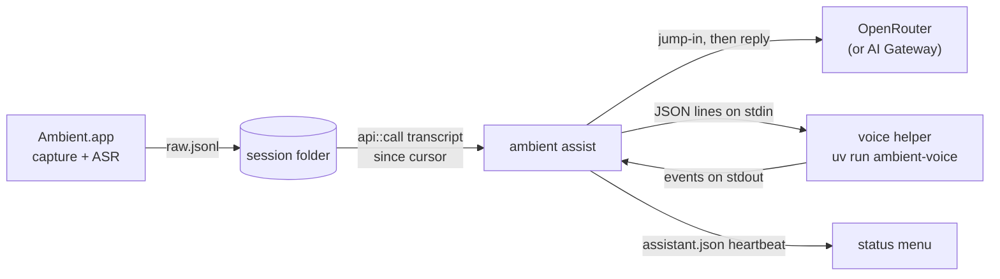

# The live assistant

A design note for `ambient assist` (`src/assist/`) and its voice helper
(`voice/`). The user's view is [the live assistant](../using/assistant.md). This
note records what was chosen, and why, for the parts a reviewer would otherwise
have to reverse-engineer: the process layout, the helper's protocol, model
downloads, the jump-in prompt and the gate around it.

## Processes



Three processes, and the recorder is never one of the new ones.

- **The recorder** is unchanged. It already publishes completed turns to
  `raw.jsonl` during capture, which is all the assistant needs.
- **`ambient assist`** is the same binary as a CLI verb, started under
  `op run` so the OpenRouter key arrives in its environment and nowhere else.
  It loads no models: its footprint is a JSON client's.
- **The voice helper** is a Python program, run with `uv run`, that loads one
  TTS model and speaks.

The split follows the memory budget. Ambient's own process must stay near
1 GiB beside live ASR ([measurements](measurements.md)); the voices that sound
human need 0.4–2.7 GB of their own. A model in the recorder would break the
budget, and a TTS crash would take a recording down with it.

### Reading the transcript

`ambient assist` calls `api::call("status")` and `api::call("transcript",
{session, since})` in process: the same dispatcher, with the same append cursor,
that `ambient mcp` puts on the wire ([ADR 0016](../adr/0016-mcp-verb-for-live-reading.md)).
Spawning `ambient mcp` and speaking JSON-RPC to it would return the same bytes
with an extra process and a pipe to supervise.

A session is live while `audio/room.native.wav` keeps growing, which is what
`status.live` reports. The assistant joins a session when it becomes live,
treats what was already said as context rather than a cue, and leaves when it
stops being live, when `assistant` is turned off, or on Ctrl-C/SIGTERM.

### On/off and the consent notice

The switch is the `assistant` setting, default off. The process re-reads it on
every one-second poll, so the menu's **Live Assistant** item silences an
assistant mid-meeting without signalling the process.

On joining a meeting the assistant first speaks a fixed notice that an AI is
listening and may speak; there is no setting to skip it. While in a meeting it
rewrites `assistant.json` beside the config file each poll with its pid,
session and state. The status menu reads that file every two seconds and shows
**AI assistant listening — it may speak** while the file is under ten seconds
old and its pid is alive, so a crashed assistant does not leave a stale
notice.

## Deciding to speak

Each poll that brings new lines from a person may ask the jump-in model. The
[`Gate`](https://github.com/jasonm4130-labs/ambient/blob/main/src/assist/gate.rs)
decides what is allowed, in this order:

1. **Cap:** `assistant.max_per_meeting` replies, then silence until the next
   meeting.
2. **Cooldown:** `assistant.cooldown_s` after each reply.
3. **Minimum interval:** the jump-in model is asked at most every four seconds.
   Lines that arrive sooner stay pending for the next poll; lines that arrive
   during a cooldown are kept as context but do not queue a question.
4. **Verdict:** the model's `speak` must be true and its `confidence` (clamped
   to 0–1) at least `assistant.threshold`.

Cap and cooldown are checked before the model is called, so a held step costs
nothing, and again on the verdict. Anything unreadable in the model's answer is
a no: silence is the safe failure for a voice in a meeting.

### The jump-in prompt

The model sees the last 40 lines as `[mm:ss] who: text` and is told to make "no"
the easy answer. It says yes only when:

- someone addresses the assistant by name, or asks "the AI" something;
- a factual question was asked, nobody answered it, and a short factual answer
  would help;
- something clearly and checkably wrong is about to be acted on.

It says no to small talk, opinions, brainstorming, questions people are already
answering, rhetorical questions and the assistant's own words, and when unsure.
It answers with one JSON object, `{"speak", "confidence", "reason"}`. The
reason, ten words or fewer, is passed to the reply model as why it was brought
in. The full text is `jump_in_system` in `src/assist/llm.rs`.

The parser accepts the object wherever it appears in the reply, because a
model that wraps JSON in a sentence or a code fence has still answered. The
request does not use `response_format`, so one parser serves every model on
the endpoint.

### The reply

The reply model gets the same lines and the reason, and returns
`{"text", "emotion"}`: one to three short spoken sentences, with no markdown or
lists, and one of six moods (neutral, warm, amused, excited, apologetic,
concerned). An unknown mood reads as neutral, and a short plain-text answer is
used as speech.

The defaults are Claude Haiku 5.5 for the jump-in call and Claude Sonnet 5.5 for
the reply, both on OpenRouter's catalogue as of 2026-10-08. Both are settings,
so a measured comparison can replace either without a code change.

### Its own voice

The speakers feed the microphone, so each reply comes back as a transcript line
a few seconds later. A line counts as an echo when it has at least three words
and at least 60% of them appear in something the assistant said in the last two
minutes, the consent notice included. An echo is kept in the context, labelled
as the assistant, and never queues a question.

## The voice helper

### Protocol

Newline-delimited JSON on stdin and stdout, one message per line, so the Rust
side needs no audio code:

```text
→ {"op":"say","id":1,"text":"...","emotion":"warm"}
← {"event":"ready","engine":"qwen3-tts","sample_rate":24000,"load_ms":1549}
← {"event":"speaking","id":1,"first_audio_ms":94}
← {"event":"done","id":1,"audio_s":7.04,"total_ms":1466}
← {"event":"error","id":1,"message":"..."}
→ {"op":"quit"}            (EOF means the same)
```

The helper writes nothing but protocol to stdout: `sys.stdout` is pointed at
stderr before any engine loads, so a library's progress bar cannot corrupt the
stream. A bad request line is an error event, never a crash.

### Supervision

`voice::Voice` owns the child:

- **Start:** `ambient assist` warms the helper at launch, so the first reply is
  not also a cold start. It waits up to ten minutes for `ready`, since the first
  run downloads the model, and kills a helper that does not answer in time.
- **Crash:** a helper that dies mid-reply is restarted and asked once more.
  After three failures in a row speech is switched off for the rest of the run;
  the assistant keeps deciding and prints its replies.
- **Error:** an engine error on one line, such as text it cannot synthesise, is
  reported without restarting a healthy helper.
- **Idle:** after five minutes without speech the helper is stopped, which
  returns its memory, and it starts again on the next reply.
- **Stop:** `quit` is sent first; a helper still running three seconds later
  is killed.

Speaking blocks the poll loop. Lines that arrive meanwhile are read on the next
poll, and nothing is lost because the cursor counts lines. The assistant cannot
be interrupted mid-sentence.

### Engines, chosen per machine

`voice.engine` is a per-Mac setting. `auto` reads `hw.memsize`:

| Installed memory | Engine | Why |
| --- | --- | --- |
| 32 GB and up | `qwen3-tts` | The most expressive, and room for its ~2.7 GB |
| 16–31 GB | `supertonic3` | Expression tags in ~0.6 GB |
| under 16 GB | `kokoro` | The smallest natural voice, ~0.4 GB |

Total memory, not free memory: the choice should not change from one meeting to
the next because a browser was open. A set value always wins over `auto`.

Qwen3-TTS is the 0.6B CustomVoice 8-bit MLX build. It streams in 0.5-second
chunks, and each reply's mood becomes its free-text instruction, prefixed by
`voice.style`. The two ONNX engines do not stream, so the helper splits a reply
into sentences and plays the first while the next is generated; a playback
thread fed by a queue keeps generation and playback overlapping.

### Model download and caching

Nothing is bundled into the app, and nothing is downloaded until the helper
first starts with that engine.

- **Runtimes:** each engine is an optional extra of the `voice/` project (`uv run --extra <engine>`).
  A Kokoro machine never installs MLX. `uv.lock` pins every version.
- **Weights:**
  - Qwen3-TTS comes from the Hugging Face hub cache (`mlx-community/Qwen3-TTS-12Hz-0.6B-CustomVoice-8bit`).
  - Supertonic uses its package's cache, `~/.cache/supertonic3`.
  - Kokoro's int8 model and voices come from the kokoro-onnx GitHub release into
    `~/Library/Caches/Ambient/voice/kokoro`. `AMBIENT_VOICE_CACHE` moves that folder.
- **espeak-ng:** Kokoro's phonemiser aborts on the wheel's long data path, so
  the helper copies `espeak-ng-data` into the same cache once.

The helper is found at `voice.helper_dir`, which defaults to the `voice/` folder
of the source tree the binary was built from. A packaged helper is future work;
for now the assistant is a source-checkout feature.

## Measurements

Measured on 2026-10-08 on an Apple M5 Max (128 GB, macOS 26). Each engine ran in
its own process through `ambient-voice --no-play`, with a warm-up line and then
the same ~6–7 s sentence twice. Peak memory is `/usr/bin/time -l`'s
`peak memory footprint` for the helper process.

| Engine | Load (warm disk) | First sound | Whole line | Peak footprint |
| --- | --- | --- | --- | --- |
| `qwen3-tts` | 1.5 s | 94–116 ms | 1.5–1.7 s for 7 s of audio | 2.73 GB |
| `supertonic3` | 0.3 s | 411–468 ms | 1.4–1.6 s | 0.56 GB |
| `kokoro` | 0.3 s | 721–741 ms | 2.8 s | 0.41 GB |

A first-ever Qwen3-TTS load from a cold disk took 15 s, which is why the helper
is warmed at launch. These figures agree with the earlier voice survey.

## Not in v1

- No avatar, no speech-to-speech model, no hosted TTS, and macOS only.
- No barge-in: the assistant finishes its sentence even if someone talks over
  it.
- No packaged helper: it needs `uv` and the source tree.
- No Settings-page control. The switch is in the status menu and
  `ambient config`.
- No eval of the jump-in prompt beyond the gate's unit tests and a sample
  meeting. Model choice should follow a measured comparison on recorded
  meetings.
