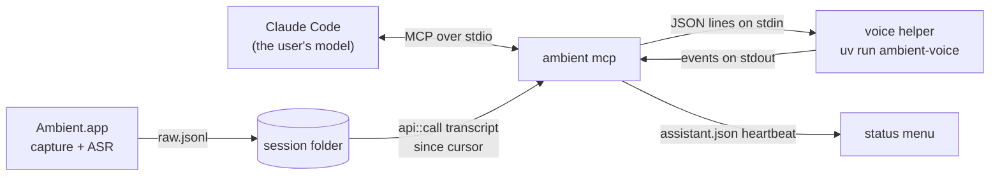

# The live assistant

A design note for the live assistant: the watching tools on `ambient mcp`
(`src/assist/`, `src/mcp.rs`) and the voice helper (`voice/`). The user's view
is [the live assistant](../using/assistant.md). This note records what was
chosen, and why, for the parts a reviewer would otherwise have to
reverse-engineer: where the model runs, the tools and prompt that drive it, the
helper's protocol, and model downloads.

## Where the model runs

The assistant's judgement is not in Ambient. The user runs Claude Code, picks
a model (`claude --model haiku`), and runs the `watch` prompt that `ambient mcp`
offers. The agent then loops on Ambient's tools, deciding after each stretch of
transcript whether to speak.



An earlier cut of this feature ran its own loop, `ambient assist`, which called
a cheap jump-in model and a reply model on OpenRouter. It was replaced before
release, for three reasons:

- **The user already pays for a model.** A subscription to Claude covers the
  agent, so the assistant needs no API key, no 1Password item and no spend
  per meeting.
- **Ambient stays off the network.** With the loop gone, Ambient makes no model
  call and holds no credential; what leaves the Mac is whatever the user's
  own agent sends.
- **One mode, not two.** Keeping the loop as an option would have kept an HTTP
  client, a secrets file, two prompts and a second set of settings, to
  duplicate what the agent does.

What did not move is everything that must hold whatever the agent does:
consent, the limits on speaking, recognising its own voice, and the voice
itself. Those live in `ambient mcp`, where an agent cannot skip them.

The process split still follows the memory budget. Ambient's own process must
stay near 1 GiB beside live ASR ([measurements](measurements.md)); the voices
that sound human need 0.4–2.7 GB of their own. `ambient mcp` loads no model:
through a replayed meeting it held 2.5–3.1 MB, sampled every two seconds with
`footprint`. The voice is a child process with its own memory, 1.1 GB with
the cloned voice.

## The tools

`ambient mcp` keeps its three session tools and adds four. `src/assist/mod.rs`
holds their state, `Watch`, one per server process.

| Tool | What it does |
| --- | --- |
| `watch_meeting` | Refuses unless `assistant` is on and a session is being recorded. Otherwise speaks the consent notice, starts the heartbeat, and returns the last 40 lines as context, the assistant's name and the limits. Calling it again for the same meeting does not repeat the notice. |
| `wait_for_transcript` | Blocks until new lines arrive, then returns them as `[mm:ss] who: text`. It also returns `status` (`live`, `ended` or `off`), whether speaking is allowed now, and how many lines were left out as the assistant's own voice. |
| `speak` | Says up to 600 characters in one of six tones, through the voice helper. Refused while off, before `watch_meeting`, during the cooldown and past the cap. Returns once the line has been said. |
| `stop_watching` | Ends the watch: the heartbeat goes and the voice is unloaded. |

A refusal is a tool result with `isError`, worded for the agent: what happened
and what to do next. A protocol error would read to the agent as a broken
server.

### Waiting and batching

`wait_for_transcript` holds its cursor on the server, so the agent passes
nothing but an optional `timeout_s` (default 30, at most 120). It polls the
transcript every half second and returns a batch when one of these happens:

- the room has been quiet for 3 s after a new line;
- 20 s have passed since the batch's first line;
- a line says the assistant's name, which returns at once;
- the timeout passes with nothing new, which returns an empty batch.

The batching keeps the agent's turns to one per burst of speech rather than one
per line. In the sample meeting, 14 lines over 75 s took 9 turns. Lines that
were in the transcript before watching started come back once, from
`watch_meeting`, as context and not as news.

The MCP loop is synchronous, so a wait holds it. Claude Code calls one tool at
a time and its tool timeout is far longer than the two-minute cap, so nothing
queues behind a wait.

### On/off, consent and the notice

The switch is the `assistant` setting, default off. `ambient mcp` re-reads it
on every watching call and on every poll inside a wait, so the menu's
**Live Assistant** item silences an assistant mid-meeting. The next wait
returns `status: off` and the watch ends.

Watching starts by speaking a fixed notice that an AI is listening and may
speak; there is no setting to skip it. If the notice cannot be spoken, for
example because the voice helper will not start, `watch_meeting` refuses: a
listener nobody heard announced is the failure this design exists to prevent.

While it watches, a thread rewrites `assistant.json` beside the config file
every two seconds, with its pid, session and state. The status menu shows
**AI assistant listening — it may speak** while the file is under ten seconds
old and its pid is alive. The file is removed when the watch ends, when the
server exits, and when the agent has made no call for three minutes. An agent
that stopped looping without saying so therefore stops claiming to listen.

### Limits on speaking

`speak` enforces two limits, whatever the agent decides
([`gate.rs`](https://github.com/jasonm4130-labs/ambient/blob/main/src/assist/gate.rs)):

- `assistant.cooldown_s` (default 60) after each utterance;
- `assistant.max_per_meeting` (default 10) utterances, then silence until the
  next meeting.

An utterance whose voice failed still counts, since retrying a stale remark
later would be worse than missing it. Each utterance is appended to the
session's `assistant.jsonl` with its text, tone and timings.

The limits belong to the meeting, not to one watch. `watch_meeting` reads the
session's `assistant.jsonl` and resumes the count and the cooldown from the
utterances already logged there, so `stop_watching` and watching again, an
off/on toggle, or a second `ambient mcp` process on the same meeting does not
reset them. The consent notice is still spoken on each new watch.

### Its own voice

The speakers feed the microphone, so each utterance comes back as a transcript
line a few seconds later. A line counts as an echo when it has at least three
words and at least 60% of them appear in something the assistant said in the
last two minutes. Echoes are left out of the batch and only counted, so the
agent never answers itself. The consent notice is checked the other way round:
a line is its echo only when it holds at least 60% of the notice's words. A
short question by name right after it, such as "Claude, are you listening?",
is made mostly of the notice's words, and dropping that would hide the most
natural first line.

### The `watch` prompt

`ambient mcp` also serves one MCP prompt, `watch`, which Claude Code offers as
`/mcp__ambient__watch`; whatever the user types after it is appended as
`focus`. The full text is `watch_prompt` in `src/assist/mod.rs`. It tells the
agent:

- to call `watch_meeting` once, then loop on `wait_for_transcript`, ending
  every turn in a tool call while the meeting is live;
- to speak when addressed by name or as "the AI" (straight away), when a
  factual question put to the room goes unanswered (only after the next lines
  show nobody answered), or when something clearly wrong is about to be acted
  on, and otherwise to stay silent;
- to say one to three sentences, at most about 40 words, as plain speech;
- to write almost nothing between calls, which keeps each turn cheap;
- to stop when the meeting ends or is switched off.

A prompt served by the MCP server, rather than a Claude Code skill or command
file, works wherever `ambient mcp` is connected and needs no extra install.

### The demo

On 2026-10-09 a real Claude Code session (`claude -p "/mcp__ambient__watch"
--model haiku`, signed in with a subscription, no API key) watched the replayed
75-second sample meeting. The voice was the cloned v1-gravel voice, run with
`--no-play`. A feeder wrote each utterance back into the room track 3 s later,
as speakers would.

- **Consent:** it spoke the notice first.
- **Small talk:** it stayed silent through the greetings, weekend chat and
  coffee.
- **Named question:** asked by name for a rate limit, it answered in two
  sentences. First sound came 3.2 s after the question was said.
- **Question to the room:** asked "429 or 503?", it waited until someone said
  they were not sure, then answered 2.6 s after the room paused.
- **Its own voice:** all three echoes were left out.
- **Ending:** when the recording stopped it ended and summarised what it had
  said.

In all it took 13 turns, and the session reported an equivalent API cost of
$0.006.

## The voice helper

### Protocol

Newline-delimited JSON on stdin and stdout, one message per line, so the Rust
side needs no audio code:

```text
→ {"op":"say","id":1,"text":"...","emotion":"warm"}
← {"event":"ready","engine":"qwen3-tts","sample_rate":24000,"load_ms":1549}
← {"event":"speaking","id":1,"first_audio_ms":94}
← {"event":"done","id":1,"audio_s":7.04,"total_ms":1466}
← {"event":"error","id":1,"message":"..."}
→ {"op":"quit"}            (EOF means the same)
```

The helper writes nothing but protocol to stdout: `sys.stdout` is pointed at
stderr before any engine loads, so a library's progress bar cannot corrupt the
stream. A bad request line is an error event, never a crash.

### Supervision

`voice::Voice` owns the child:

- **Start:** `watch_meeting` starts the helper, because the consent notice is
  its first line. It waits up to thirty minutes for `ready`, since the first
  run downloads the model, and kills a helper that does not answer in time.
- **Crash:** a helper that dies mid-line is restarted and asked once more.
  After three failures in a row speech is switched off for that watch, and
  `speak` reports the failure to the agent.
- **Error:** an engine error on one line, such as text it cannot synthesise, is
  reported without restarting a healthy helper.
- **Lifetime:** the helper stays loaded for the whole watch, because a cold
  start would make a reply about 1.5 s late. It is stopped when the watch
  ends, which returns its memory, and the next watch starts a fresh one from
  the settings of the day.
- **Stop:** `quit` is sent first; a helper still running three seconds later
  is killed.

`speak` returns once the line has been said. Lines that arrive meanwhile are
read by the next wait, and nothing is lost because the cursor counts lines.
The assistant cannot be interrupted mid-sentence.

### Engines, chosen per machine

`voice.engine` is a per-Mac setting. `auto` reads `hw.memsize`:

| Installed memory | Engine | Why |
| --- | --- | --- |
| 32 GB and up | `qwen3-tts` | The most expressive, and room for its ~2.7 GB |
| 16–31 GB | `supertonic3` | Expression tags in ~0.6 GB |
| under 16 GB | `kokoro` | The smallest natural voice, ~0.4 GB |

Total memory, not free memory: the choice should not change from one meeting to
the next because a browser was open. A set value always wins over `auto`.

Qwen3-TTS is the 0.6B CustomVoice 8-bit MLX build. It streams in 0.5-second
chunks, and each reply's mood becomes its free-text instruction, prefixed by
`voice.style`. The two ONNX engines do not stream, so the helper splits a reply
into sentences and plays the first while the next is generated; a playback
thread fed by a queue keeps generation and playback overlapping.

### Designed voices: design once, clone for every reply

The captain's voice, `voice/voices/v1-gravel`, is described rather than
picked from a preset list. Qwen3-TTS can only design a voice with its 1.7B
VoiceDesign model, which peaks around 5.6 GB and re-imagines the voice on
every call. So the description is rendered once into a short reference clip,
and every reply comes from the 0.6B Base model cloning that clip in context.
The voice is then the same on every line, at a fraction of the memory.

The cost is per-line emotion. The clone path takes no instruction, so a
reply's mood reaches the voice only through its words.

A designed voice is a folder holding `reference.wav` and `voice.json`. The
JSON holds the clip's transcript and the description, cue, model and seed it
came from.

- **Shipped voice:** `v1-gravel` is committed. It is the first sentence (3.8 s)
  of the render the captain approved, so no machine needs the 1.7B model to
  use it.
- **Other voices:** `voice.description` and `voice.cue` design one on first
  use. The design is cached under `designed/`, keyed by everything that shaped
  it, so editing the description makes a new voice rather than reusing a stale
  one.

**The voice pack.** Loading the 0.6B clone model as published peaks at 2.8 GB.
Most of that is not the quantised layers:

- a 151,936 × 2048 bf16 text-embedding table (622 MB) that mlx-audio
  deliberately leaves unquantised;
- ~0.7 GB of fp32 speech-tokenizer weights.

On first use the helper loads the model lazily and slims it:

- the 4-bit checkpoint, with the text embedding quantised to 8-bit;
- the speech decoder cast to fp16, which measured 37–51 dB SNR against fp32
  on identical codes;
- the reference encoded once.

It saves the result under `packs/`, keyed by model and reference. Later
starts build the model straight from the pack without the speech encoder,
which is only needed to encode the reference, and seed mlx-audio's reference
cache with the saved codes. The loader mirrors mlx-audio 0.5.8's own
(`base_load_model` and the Qwen3-TTS `post_load_hook`). `pyproject.toml` pins
that version, and `PACK_VERSION` invalidates old packs when the layout changes.

### Model download and caching

Nothing is bundled into the app, and nothing is downloaded until the helper
first starts with that engine.

- **Runtimes:** each engine is an optional extra of the `voice/` project (`uv run --extra <engine>`).
  A Kokoro machine never installs MLX. `uv.lock` pins every version.
- **Weights:**
  - Qwen3-TTS comes from the Hugging Face hub cache (`mlx-community/Qwen3-TTS-12Hz-0.6B-CustomVoice-8bit`).
  - Supertonic uses its package's cache, `~/.cache/supertonic3`.
  - Kokoro's int8 model and voices come from the kokoro-onnx GitHub release into
    `~/Library/Caches/Ambient/voice/kokoro`. `AMBIENT_VOICE_CACHE` moves that folder.
- **Designed voices and packs:** `~/Library/Caches/Ambient/voice/designed`
  and `…/packs`, about 0.9 GB per voice.
- **espeak-ng:** Kokoro's phonemiser aborts on the wheel's long data path, so
  the helper copies `espeak-ng-data` into the same cache once.

The helper is found at `voice.helper_dir`, which defaults to the `voice/` folder
of the source checkout the binary runs from. A packaged helper is future work;
for now the assistant is a source-checkout feature.

## Measurements

Measured on 2026-10-08 on an Apple M5 Max (128 GB, macOS 26). Each engine ran in
its own process through `ambient-voice --no-play`, with a warm-up line and then
the same ~6–7 s sentence twice. Peak memory is `/usr/bin/time -l`'s
`peak memory footprint` for the helper process.

| Engine | Load (warm disk) | First sound | Whole line | Peak footprint |
| --- | --- | --- | --- | --- |
| `qwen3-tts` | 1.5 s | 94–116 ms | 1.5–1.7 s for 7 s of audio | 2.73 GB |
| `supertonic3` | 0.3 s | 411–468 ms | 1.4–1.6 s | 0.56 GB |
| `kokoro` | 0.3 s | 721–741 ms | 2.8 s | 0.41 GB |

A first-ever Qwen3-TTS load from a cold disk took 15 s, which is why the helper
is warmed at launch. These figures agree with the earlier voice survey.

The cloned `v1-gravel` voice was tuned step by step, each step in its own
process with three test lines:

| Step | Peak footprint | Steady footprint | First sound |
| --- | --- | --- | --- |
| Clone as published: 8-bit, 7.2 s reference, 0.32 s chunks | 2.78 GB | 2.40 GB | 73–118 ms |
| 4-bit talker | 2.50 GB | — | 69–82 ms |
| 3.8 s reference | 2.73 GB | — | 73–78 ms |
| 0.16 s stream chunks | 2.72 GB | — | 44–59 ms |
| MLX buffer cache left at its default (for contrast) | 3.73 GB | — | 74–77 ms |
| All slimming, applied after a lazy load | 2.19 GB | 1.30 GB | 55–89 ms |
| **Voice pack, loaded through the helper (shipped)** | **1.56 GB** | **1.13 GB** | **46–57 ms** |

The first start on a machine builds the pack, peaking at 2.71 GB once.
Everything above transcribed word-for-word through Ambient's Parakeet, and
median pitch stayed within the approved clips' range. Whether it sounds the
same was left to a listen; the A/B clips are outside the repository.

## Not in v1

- No avatar, no speech-to-speech model, no hosted TTS, and macOS only.
- No barge-in: the assistant finishes its sentence even if someone talks over
  it.
- No packaged helper: it needs `uv` and the source tree.
- No per-reply emotion for a cloned voice. A reference clip per mood, designed
  from the same description, is the untested next step.
- No Settings-page control. The switch is in the status menu and
  `ambient config`.
- No eval of the `watch` prompt beyond the tools' unit tests and the sample
  meeting. Which model watches is the user's choice in Claude Code; Haiku was
  enough for the sample, and a measured comparison on recorded meetings should
  settle the default advice.
- No agent other than Claude Code tried. Any MCP client that calls tools in a
  loop should work, but only Claude Code was run.
