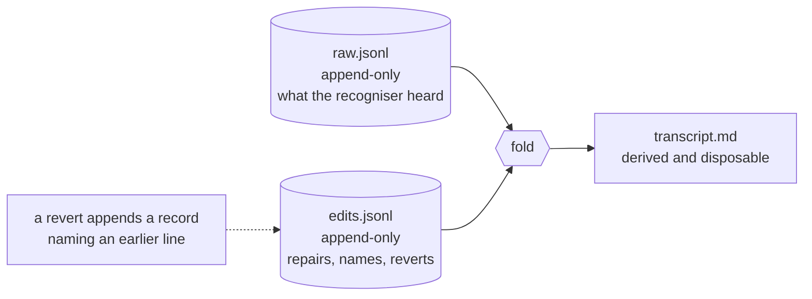

# Sessions and the edit layer

A session is what `ambient record` leaves on disk: the audio, what the
recogniser heard, every subsequent repair, and a markdown export derived from
the two. This chapter covers recording one, stopping it, editing it, and
exporting it.

`ambient record [--name <s>] [--app <bundle-id>]… [--seconds <n>]` captures
until stopped, then resamples, transcribes and writes a session under
`~/Documents/Ambient` (`AMBIENT_HOME` overrides):

```
2026-08-29T1101-smoke/
  session.json     metadata, written when the capture ends
  raw.jsonl        what the recogniser heard — never rewritten
  edits.jsonl      repairs, speaker names, reverts — append-only
  transcript.md    the export, regenerated on every change
  status           live level meter while recording, then the stage
  audio/room.wav   mono 16 kHz, mic
  audio/call.wav   mono 16 kHz, tap
```

The work is two halves, `capture_into` and `transcribe_session`, and `record`
is their composition. The capture half owns the tap and ends with the 16 kHz
wavs and `session.json` on disk; the transcription half turns those into
`raw.jsonl` and `transcript.md`. The CLI runs them back to back on one
thread. The menu bar app runs the second on a serial queue instead, so a new
recording can start while the last one is still being transcribed
([ADR-0015](../adr/0015-capture-and-transcription-are-separate.md)). `status`
records the stage: `recording …` with the level meter, then `finishing`,
`captured`, `transcribing`, `separating voices`, `done` — or `failed: …`.
A session showing `captured` with the app not running is waiting on a queue
that no longer exists; the app re-queues it at its next launch.

Two append-only logs and one derived file, folded on read:



## Stopping one

`ambient stop` — with no argument it finds the recording in flight and prints
what it stopped:

```
$ ambient stop
  recording 00:22  room 0.310  call 0.828
/Users/…/Documents/Ambient/2026-08-29T1223-standup
```

It writes a `STOP` file that the capture loop notices on its next 200 ms tick.
A file rather than a signal because the only launch that gets system audio is
LaunchServices', which has no terminal to Ctrl-C and no pid a user can see —
and for the same reason the level meter is mirrored to `status`, since stderr
under `open -a` goes nowhere. Ctrl-C still works when there is a terminal, and
`--seconds <n>` bounds an unattended run.

Nothing guards against a second recording. `record` creates its directory
(`src/session.rs:246`) and starts the tap (`src/session.rs:248`) without ever
asking whether one is already live, and `live_session` — the only way a bare
`ambient stop` finds its target (`src/session.rs:948`) — collects every session
directory whose `audio/room.native.wav` was written to in the last ten seconds,
sorts them and pops (`src/session.rs:925`).

The sort is lexicographic over the whole directory name, and that name is a
minute-resolution timestamp plus, when `--name` was given, a slug
(`src/session.rs:240-243`). So what pops is the lexicographically last name,
which is the newest only when the two recordings started in different minutes;
inside one minute the slug decides, and a named session sorts after an unnamed
one whatever the clock said. A bare stop reaches whichever that is and leaves
the other running, so `ambient stop <dir>` (`src/main.rs:66`) is the reliable
form when two are in flight.

Two same-minute recordings with the same name — or with no name, which is what
both a bare `ambient record` and the menu bar use — compute the identical id,
and used to share the directory it named, because `create_dir_all` is
idempotent. They no longer can. `SessionDir::claim` is the only constructor and
claiming is what creates the directory, with `create_dir` rather than
`create_dir_all`: an occupied name comes back `AlreadyExists` instead of
succeeding into it, so the second recording retries as `-02`, `-03` and so on
up to `-99`. A `SessionDir` is therefore evidence that no other recording is
writing there, and the suffix is zero-padded because every listing here is a
byte sort and an unpadded `-10` would sort before `-2`. The id a session
reports is the directory's own name and never the string that was formatted to
ask for it.

That is the shape the sentinel forces rather than an oversight. A `STOP` file
carries no pid, and nothing keeps a registry of live sessions, so liveness is
inferred from one file's modification time and "the newest" is the only
question that mechanism can answer. The same check is why a `record` killed
mid-recording does not intercept a later stop: its scratch wavs stay on disk,
and without the ten-second window that corpse answers `ambient stop`, pointing
it at a directory nothing is writing to. The menu's level line used to be
exposed to the same thing from the other side: during transcription the scratch
wavs are gone, so it fell back to whichever entry in the sessions folder sorted
last — a corpse, or `app.log`, which sorts after every `2…` id. It reads the
capture worker's shared `Meter` now and consults the folder for nothing, which
is what let that fallback be deleted rather than repaired; `app.log` has also
moved out to `~/Library/Logs/Ambient/`. Clearing a corpse out is under [when it
does not work](../using/troubleshooting.md).

`ambient show <dir>` folds `edits.jsonl` over `raw.jsonl`; `--verbatim` skips
the fold. Reverts append a record naming an earlier line rather than deleting
it, so the raw transcript is always recoverable byte-for-byte — verified by
hashing `raw.jsonl` either side of applying an edit layer.

Track is the attribution `record` writes on its own, and for a one-to-one call
it is already complete: room is you, call is them. Several people round a table
or on the same call need `ambient diarize`.

`record` writes one record per turn rather than per recogniser call; why that
matters, and how `Vad::turns` differs from `Vad::chunks`, is in
[VAD and chunking](vad-and-chunking.md). The capture layer runs at the device
rate and everything downstream demands 16 kHz — see
[Resampling](asr.md) for how that gap is closed.

Measured on one 19.8 s two-track recording — the same sentence reaching the tap
directly and the microphone acoustically:

```
call (tap, peak 0.869)   "... Priya merged the chunking fix, so the retry-storm ..."
room (mic, peak 0.261)   "... Pre emerge the chunking fix, so the retry storm ..."
```

Which is the argument for tapping rather than pointing a microphone at a
speaker, in one line.

## Naming speakers

`ambient name <dir> call-1 Priya` renames every line currently carrying that
label. It appends `speaker` edits like anything else, so it is undoable, and
re-running `diarize` afterwards leaves the name alone — diarization reverts its
own labels but skips any record a person has since named. Without that guard
the later edit would win the fold and quietly turn Priya back into `call-1`.

## Export

`ambient export <dir> [--out <path>]` writes `transcript.md`, and `record`,
`diarize` and `name` each regenerate it, so the file on disk is never stale.
It is derived — `raw.jsonl` plus `edits.jsonl` stay the only source of truth,
and deleting the markdown loses nothing. YAML front matter carries the session
metadata, which is what a downstream Confluence pipeline would read — that
pipeline lives outside this repo:

```markdown
---
id: "2026-08-29T1223-standup"
name: "standup"
started_at: "2026-08-29T12:23:47.913732+10:00"
duration_s: 20.0
model: "sherpa-onnx-nemo-parakeet-tdt-0.6b-v3-int8"
speakers: ["Priya", "call-2"]
---

# standup

**[00:00] Priya** (call)
Right, let's start with the Transcoda backlog…

---
_2 room line(s) suppressed as call-track duplicates._
```

### The microphone overhears the call

The room mic picks up the laptop speakers, so on speakerphone every remote
utterance is transcribed twice — once badly by the mic, once well by the tap.
Both tracks in the recording above carried all the same lines. Merging them
without dedup produces a document that reads as broken, and nothing errors:
the file is just wrong.

`dedup_bleed` drops a room line when a call line overlaps it by at least half
the shorter span **and** shares at least 60% of the shorter line's words, after
lowercasing and stripping punctuation. Only room lines are ever dropped — the
call track is both the better copy and the side that cannot be reconstructed if
it goes missing.

The threshold has to survive two independent ASR passes disagreeing (`retry
storm` against `retry-storm`, `Transcoda` against `Transcoder`) without eating
genuine cross-talk, which is the failure that would matter. Both cases are unit
tests, and the fixture strings are real ones the two tracks produced.

### Room noise does not merely add junk — it derails the decode

Silero reports 0.6–0.9 on quiet room noise, confidently enough that no
probability threshold separates it from real speech at 0.92–1.00. So a VAD turn
would open in noise and run into the speech, and Parakeet given that prefix did
not transcribe the speech plus some junk — it invented a different sentence
outright. The same audio, measured:

| Fed to the recogniser | Out |
| --- | --- |
| 2.6 s of room noise + the utterance | "The gap had not closed. If anything, it had wide." |
| the utterance alone | "The migration is scheduled for Thursday morning." |

Level separates a turn's quiet EDGES from its speech, and trimming them matters
because a noise prefix does not merely add junk — it derails the decode. So each
turn is trimmed on level before the recogniser sees it.

The floor is **relative to the track's own loudest content, and only that**. An
absolute floor was tried and removed after it threw away a real recording whole:
quiet speech captured across a room measured −42 dB p90 while a genuinely silent
room measured −44 dB. **Two decibels apart.** Any absolute threshold that rejects
the empty room also rejects real speech.

Three signals were measured and none of them separates quiet speech from an
empty room:

| Signal | Real quiet speech | Hallucination from silence |
| --- | --- | --- |
| level (p90) | −42 dB | −44 dB |
| Silero probability | 0.6–0.9 | 0.6–0.9 |
| decoder confidence | 0.959 | 0.917 |

Decoder confidence does catch the *derailment* case — 0.992 for the trimmed
utterance against 0.613 for the same one with noise in front — which is why the
trim is worth having. But Parakeet is confidently wrong on pure noise, so a
room track that is nothing but noise still reaches the recogniser and can still
produce an invented line.

That is a semantic problem, not a threshold problem: it needs something that can
read the words. `confidence` is recorded per line in `raw.jsonl` to give a
downstream cleanup pass something to weigh.

See [ADR-0008](../adr/0008-append-only-raw.md).
