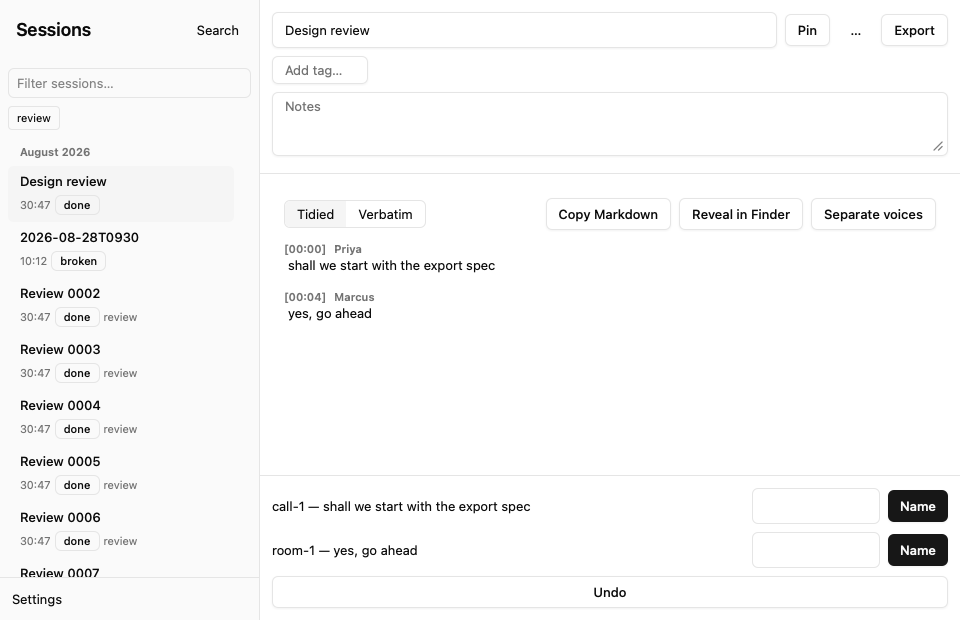
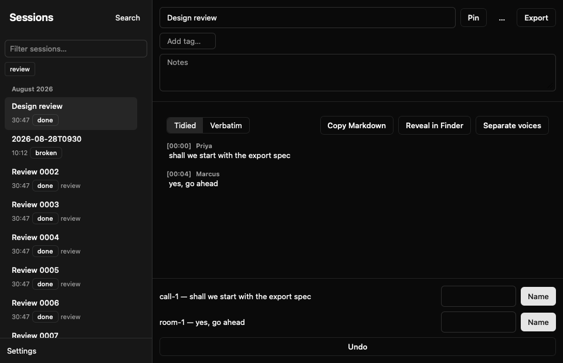

# The React UI

The Ambient window hosts one React page. `src/window.rs` creates the window,
installs the web view as its content view, and retains AppKit's activation
policy and menu actions. `src/settings.rs` owns the request/response bridge,
native dialogs and the diarization worker. Closing the window returns Ambient
to the menu bar without stopping a recording.

## Build and check

```sh
pnpm --dir ui install --frozen-lockfile
pnpm --dir ui check
pnpm --dir ui lint
pnpm --dir ui test
pnpm --dir ui build
scripts/check
cargo run --bin windowcheck
cargo run --bin uicheck -- docs/developing/img/ui-light.png light
cargo run --bin uicheck -- docs/developing/img/ui-dark.png dark
```

Vite inlines scripts and styles into `assets/settings.html`, which Rust embeds
at compile time. Commit that file with every UI change. A subsequent build
must leave `git diff --exit-code assets/settings.html` clean. No resource is
fetched at runtime.

`windowcheck` uses the real host and dispatcher with disposable sessions. It
checks transcript rendering, phase updates, selection, Stop, Settings and File
menu dispatch without opening an audio device. `uicheck` uses canned replies
to exercise exports and Settings, then scrolls 2,000 sessions and saves a PNG.
It checks fewer than 300 mounted rows and less than 16 ms of elapsed work per
sample, including the timer wait and layout read. These are local measurements,
not a guarantee for every Mac. Native save panels and audio grants still need
interactive checks in the signed app.

## Routes and state

`App` asks `init` for the starting route and listens for `navigate`. Sessions
loads the session summaries; Settings edits the same config and roster as the
CLI. Welcome appears for an empty library or a failing `doctor` check. Its
inline fixes are checked against [troubleshooting](../using/troubleshooting.md)
by a component test, and Settings remains reachable while health fails.

The page retains selection, filters and unsaved drafts. Persisted values come
from API replies and are requested again after a mutation. `useLatest` drops
old responses and failures when a newer request supersedes them. Phase events
update the live card; phase transitions refresh summaries. Diarization events
refresh both transcript text and unnamed speaker controls.

Session rows are 56 px high and month headers are 28 px. The sidebar renders
the viewport plus ten entries on either side, with arithmetic spacers for the
rest. Long names and tags truncate within the fixed row. Text and tag filters
reset the scroll position; arrow keys move selection and focus across virtual
rows. The live card sits above the scrolling list.

## Appearance and shortcuts

The page uses system fonts, the neutral theme, a 0.5 rem radius, 13 px body
text and 11 px secondary text. The sidebar is 260 px wide and transcript text
is limited to 68 characters. Focus rings remain visible for keyboard use;
reduced-motion preferences disable animations and transitions. Appearance
follows macOS through `prefers-color-scheme`; the probe can force an appearance
for screenshots without adding a user-facing toggle.

| Shortcut | Action |
| --- | --- |
| ⌘, | Settings |
| ⌘0 | Sessions |
| ⌘R / ⌘S | Start / stop recording |
| ⌘K | Search transcripts |
| ⌘⇧C | Copy Markdown |
| ⌘⇧R | Reveal in Finder |

The following screenshots come from the built page in a real WKWebView with
synthetic sessions.




