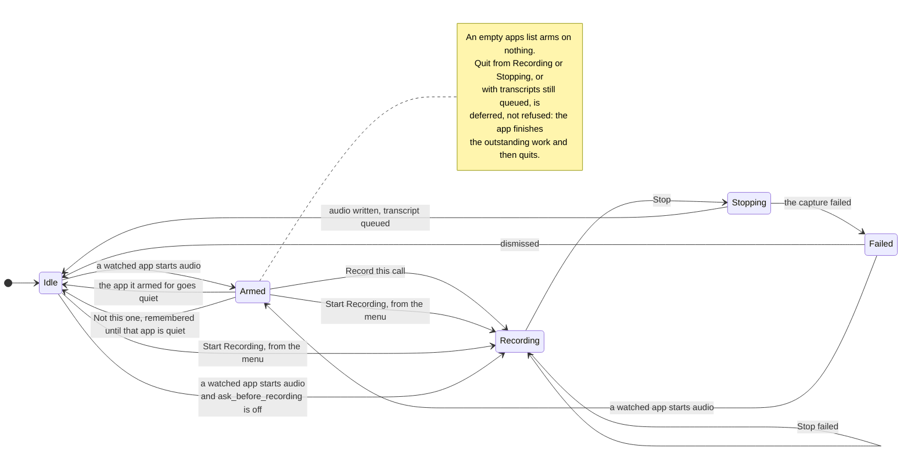

# What is kept

Consent, retention and the roster are three answers to one question: what this
tool is allowed to keep, and for how long. Consent decides whether a recording
starts at all, retention decides how long the audio outlives the transcript,
and the roster decides what is stored about the people in it.

## Where the data goes

Sessions are ordinary files in `~/Documents/Ambient` unless you choose another
folder. Ambient does not encrypt them separately from your Mac's storage.
Cloud folder sync and backups can copy them elsewhere. Exports and MCP clients
can also share transcript text beyond this Mac; see [MCP access](mcp.md#access-and-privacy).

The recording prompt asks you, not the other participants. Obtain appropriate
permission before recording. Ambient does not join the call or announce the
recording to the people in it.

## Recording states

The menu bar is the consent surface — the window can be closed, and answering
about a call never needs it open — and it is a state machine:

Three of those edges are worth reading twice. A **stop that fails** leaves the
phase at `Recording`, because that is the honest state — the worker really is
still recording, so Stop stays enabled and Start stays disabled rather than the
app advancing past a capture it never stopped. `Failed` is watched exactly
like `Idle`: a failure nobody has dismissed does not stop the next call being
noticed. And **transcription is not a state at all**. `Stopping` lasts the
seconds it takes to write the audio; the transcript is then written by a
queue, one session at a time, while the app sits at `Idle` — so the next call
can be recorded while the last is still being transcribed, which is what
back-to-back meetings need. The menu shows what the queue is doing and how
many sessions are waiting, and the icon is an hourglass until it is empty
([ADR-0015](../adr/0015-capture-and-transcription-are-separate.md)).

## Consent: the armed state

With `apps` set, the menu bar watches for one of them producing audio and moves
to a fourth state, **Armed** — the menu then offers *Record this call* or *Not
this one*. Declining is remembered **against that bundle id and no other**, so
saying no to Teams says nothing about Zoom, and it is forgotten once that app
stops producing audio, so it does not opt out of the next call either. Standing
down from Armed is keyed the same way: it is the app Ambient armed for going
quiet that ends the wait, not the machine falling silent, so a music player
left running all day cannot hold the prompt open after the call has ended.

An empty `apps` list watches nothing. That list already means "capture all
system audio", and arming on any sound at all would flap at every notification
chime; the Start item stays the way in.

The check runs on the existing refresh timer, every eighth tick — roughly every
four seconds. Enumerating audio processes twice a second would be waste for
something that changes when a human joins a call.

There is no system notification for the armed state. The menu bar is the
recording control: an unmistakable state you can
see without clicking. A real `UNUserNotificationCenter` prompt is additive and
should be scoped on its own rather than smuggled in here.

## Retention

Audio is the most sensitive artefact here and the least useful once the
transcript exists, so it ages out on a schedule while the text does not.
`audio_retention_days` defaults to 7; `0` deletes the wavs as soon as the
transcript is written, `forever` keeps them. `ambient delete` is a separate,
deliberate action that removes the whole session directory — retention only
ever removes audio. The sweep runs at the end of every
recording — the app is running whenever a recording happens, so no launchd
agent is needed — and it never touches `raw.jsonl`, `edits.jsonl`,
`session.json` or `transcript.md`.

Two guards matter. A session with no `transcript.md` is never swept: it is
still being written, and its audio is the only copy of what was said. That guard
has a consequence worth stating plainly — a recording that *failed* also has no
`transcript.md`, so its audio is kept indefinitely rather than ageing out. Those
directories are the ones to check by hand if you care about the retention
window holding. And
`ambient diarize` **refuses** on a session whose audio has been swept, because
a re-run reverts the previous labels before it discovers there is nothing to
read — which would silently unlabel every speaker nobody had named by hand. The
window says the same thing before you can ask: on a swept session *Separate
voices* is disabled and carries the reason under it, rather than offering a
button that would only refuse.

## Who's who

`ambient roster add <name>` keeps a list of the people you record with, in
`roster.json` beside the config. Under the transcript of **whichever session is
selected** in the window, each speaker diarization could not name gets a row
carrying the first thing that voice said, and a dropdown of roster names puts a
name on every line of that speaker. It is any session and not only the most
recent one: the naming strip follows the selection.

The roster stores names, not voiceprints. Ambient does not use it to recognize
a person across sessions. You choose which name belongs to a speaker; check the
result before sharing the transcript.

Naming from the window writes the same edit `ambient name` does, so it is
recorded as the user's and survives a re-diarize.

See [ADR-0009](../adr/0009-armed-consent-state.md), [ADR-0010](../adr/0010-names-not-voiceprints.md) and [ADR-0011](../adr/0011-audio-retention-sweep.md).
